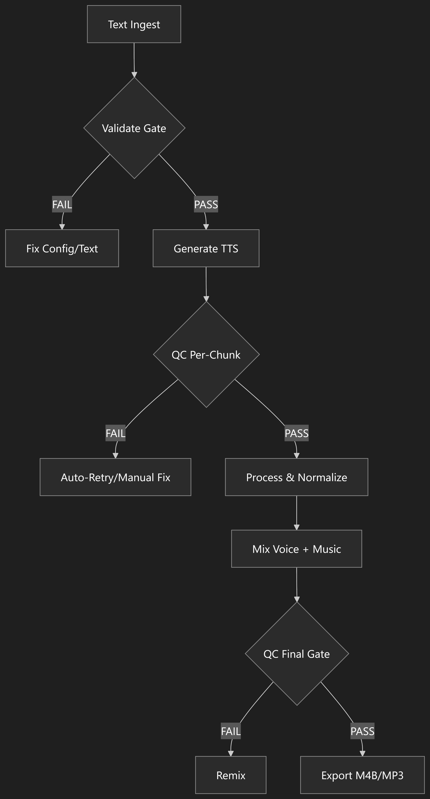
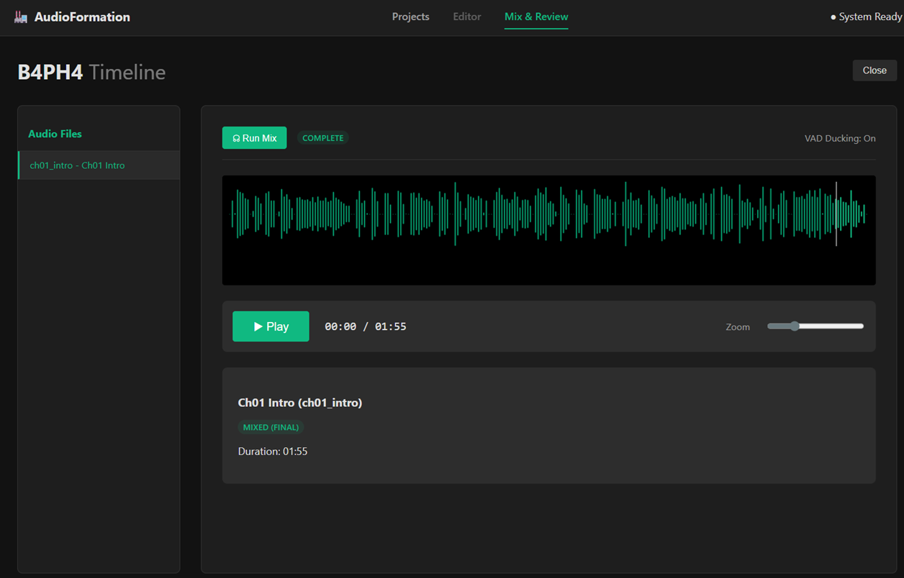

# 🏭 AudioFormation

## Description

**Production audio pipeline: Voice, SFX, Music, Mix, Export.**

Companion to VideoFormation (same architecture, different domain).

### Philosophy (Mirrors VideoFormation)

Principle	| Implementation
-----------|---------------
Single Source of Truth	| project.json governs everything
Validation Gates	| Hard gates before generation, mixing, export
Automation First	| CLI drives pipeline; dashboard is optional
Engine Agnostic	| Swap TTS/music engines without touching project files
Hardware Aware	| Auto-detects GPU, suggests optimal engine
Bilingual First	| Arabic + English as primary languages

## Installation

### Prerequisites
- Python 3.11+
- ffmpeg on PATH
- Optional: NVIDIA GPU with 4GB+ VRAM for XTTS voice cloning

### Basic Installation
```bash
# Install with core dependencies (includes edge-tts, audio processing, etc.)
pip install -e ".[cloud]"

# Or for development
pip install -e ".[dev,server]"
```

### TTS Engine Dependencies

AudioFormation supports multiple TTS engines. Install the optional dependencies based on your needs:

```bash
# Cloud TTS engines (recommended for most users)
pip install -e ".[cloud]"
# Includes: gTTS, ElevenLabs, httpx, python-dotenv
# Note: edge-tts is always installed (main dependency)

# Local voice cloning (requires GPU)
pip install -e ".[xtts]"
# Includes: coqui-tts (XTTS v2)

# Voice activity detection for ducking
pip install -e ".[vad]"
# Includes: silero-vad

# Web dashboard
pip install -e ".[server]"
# Includes: fastapi, uvicorn, aiofiles, python-multipart

# M4B audiobook export
pip install -e ".[m4b]"
# Includes: mutagen

# MIDI composition
pip install -e ".[midi]"
# Includes: midiutil

# Full installation (all features)
pip install -e ".[cloud,xtts,vad,server,m4b,midi,dev]"
```

### API Keys Required

Some engines require API keys:

**ElevenLabs** (optional):
```bash
export ELEVENLABS_API_KEY="your_api_key_here"
```

## Quick Start

```bash
# Create a project
audioformation new "MY_NOVEL"

# Start the Dashboard
audioformation serve
# Open http://localhost:4001 in your browser
```

Or use the CLI:

```bash
# Ingest text
audioformation ingest MY_NOVEL --source ./chapters/

# Generate (edge-tts with gTTS fallback)
audioformation generate MY_NOVEL --engine edge

# Mix (Voice + Music + Ducking)
audioformation mix MY_NOVEL

# Export
audioformation export MY_NOVEL --format m4b
```

## TTS Engine Support

AudioFormation supports multiple TTS engines with different capabilities:

| Engine | Type | Languages | Cost | Dependencies |
|--------|------|-----------|------|--------------|
| **Edge-TTS** | Cloud | Arabic, English, many others | Free | `edge-tts` |
| **gTTS** | Cloud | 100+ languages | Free | `gTTS` |
| **ElevenLabs** | Cloud | English (premium voices) | Paid | `elevenlabs` + API key |
| **XTTS v2** | Local | Multilingual | Free | `coqui-tts` + GPU |

### Engine Selection
```bash
# Use Edge-TTS (default, best for Arabic)
audioformation generate PROJECT --engine edge

# Use gTTS (fallback, more languages)
audioformation generate PROJECT --engine gtts

# Use ElevenLabs (premium quality)
audioformation generate PROJECT --engine elevenlabs

# Use XTTS v2 (local voice cloning)
audioformation generate PROJECT --engine xtts
```

## Features
Feature | Status
-------|-------
Edge TTS (free, Arabic + English) | ✅ BUILT
SSML direction mapping | ✅ BUILT
Text chunking (breath-group) | ✅ BUILT
Per-chapter QC scanning | ✅ BUILT
QC Scan API endpoint | ✅ BUILT
LUFS normalization | ✅ BUILT
MP3 export with manifest | ✅ BUILT
Arabic diacritics detection | ✅ BUILT
Engine fallback chain (edge-tts → gTTS) | ✅ BUILT
XTTS v2 engine adapter | ✅ BUILT
ElevenLabs engine adapter | ✅ BUILT
Multi-speaker dialogue | ✅ BUILT
Ambient pad generation | ✅ BUILT
VAD-based ducking | ✅ BUILT
M4B audiobook export | ✅ BUILT
Web dashboard | ✅ BUILT
Run All Pipeline | ✅ BUILT

## Architecture

AudioFormation follows a modular pipeline architecture with five core domains:

```
audioformation CLI → Pipeline State Machine
├── TTS Engines (edge, gtts, xtts, elevenlabs) ✅ IMPLEMENTED
├── Audio Processor (normalize, trim, stitch) ✅ IMPLEMENTED
├── Ambient Composer (pad generation) ✅ IMPLEMENTED
├── Mixer (multi-track, VAD ducking) ✅ IMPLEMENTED
├── QC Scanner (per-chunk quality) ✅ IMPLEMENTED
└── Exporter (MP3/M4B + manifest) ✅ IMPLEMENTED
```

### Implementation Status

- ✅ **Phase 1 Complete**: Core TTS pipeline, QC, audio processing
- ✅ **Phase 2 Complete**: Cloud TTS adapters, voice cloning, multi-speaker, CLI tools
- ✅ **Phase 3 Complete**: Mixer with ducking, M4B export, web interface (Editor/Mix)
- ✅ **Phase 4 Complete**: Dashboard v2.0
- ⏳ **Phase 5 Future**: Real Music & Algorithmic composition, advanced features

## Dashboard

The dashboard (`audioformation serve`) provides a visual interface for:
*   **Project Management**: Create and list projects.
*   **Editor**: Configure generation settings, edit chapter metadata, trigger generation per-chapter.
*   **Mix & Review**: Visualize audio waveforms (`wavesurfer.js`), play back generated/mixed audio, trigger the mixing pipeline.
*   **Run All Pipeline**: Single-click execution of entire audiobook workflow (validate → generate → QC scan → process → compose → mix → export).

### Workflow Overview



### Dashboard Interface



## Testing
```bash
pip install -e ".[dev]"
pytest -v
# or
pytest --cov=src --cov-report=term-missing
```

## Contributing
1. Fork the repository
2. Create a feature branch (`git checkout -b feature/amazing-feature`)
3. Commit your changes (`git commit -m 'Add amazing feature'`)
4. Push to the branch (`git push origin feature/amazing-feature`)
5. Open a Pull Request

## License
MIT
