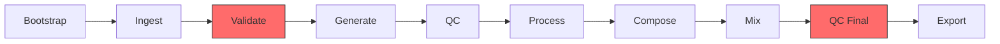

# 🏭 AudioFormation

## Description

**Production audio pipeline: Voice, SFX, Music, Mix, Export.**

Companion to VideoFormation (same architecture, different domain).

### Philosophy (Mirrors VideoFormation)

Principle	| Implementation
-----------|---------------
Single Source of Truth	| project.json governs everything
Validation Gates	| Hard gates before generation, mixing, export
Automation First	| CLI drives pipeline; dashboard is optional
Engine Agnostic	| Swap TTS/music engines without touching project files
Hardware Aware	| Auto-detects GPU, suggests optimal engine
Bilingual First	| Arabic + English as primary languages

## Quick Start

```bash
# Install
pip install -e ".[dev]"

# Set up pre-commit hooks (recommended)
pre-commit install

# Verify
audioformation --version
audioformation hardware

# Create a project
audioformation new "MY_NOVEL"

# Add text files
cp chapters/*.txt PROJECTS/MY_NOVEL/01_TEXT/chapters/

# Or ingest from a directory
audioformation ingest MY_NOVEL --source ./chapters/

# Validate
audioformation validate MY_NOVEL

# Generate audio (edge-tts with gTTS fallback)
audioformation generate MY_NOVEL --engine edge
# Falls back to gTTS automatically if edge-tts fails (403/500 errors)

# Check quality
audioformation qc MY_NOVEL --report

# Process (normalize + trim)
audioformation process MY_NOVEL

# Export
audioformation export MY_NOVEL --format mp3

# Or run the full pipeline
audioformation run MY_NOVEL --all
```

## Quick Generation (No Project)

```bash
# English
audioformation quick "Hello world" --voice en-US-GuyNeural -o hello.mp3

# Arabic
audioformation quick "مرحبا بالعالم" --voice ar-SA-HamedNeural -o hello_ar.mp3

# From stdin
echo "مرحبا" | audioformation quick --voice ar-SA-HamedNeural
```
## Requirements
Python 3.11+
ffmpeg on PATH
Optional: NVIDIA GPU with 4GB+ VRAM for XTTS voice cloning

## Engine Support
- **edge-tts**: Free, excellent Arabic voices, upgraded to v7 for DRM compatibility
- **gTTS**: Emergency fallback, activates automatically on edge-tts failures
- **XTTS v2**: Local voice cloning, engine adapter built (requires GPU, `pip install -e ".[xtts]"`)
- **ElevenLabs**: Cloud TTS adapter built (requires API key, `pip install -e ".[cloud]"`)
- **Cloud engines**: OpenAI TTS, Gemini TTS (Phase 3, API keys required)

## Features
Feature | Status
-------|-------
Edge TTS (free, Arabic + English) | ✅ BUILT
SSML direction mapping | ✅ BUILT
Text chunking (breath-group) | ✅ BUILT
Per-chunk QC scanning | ✅ BUILT
LUFS normalization | ✅ BUILT
MP3 export with manifest | ✅ BUILT
Arabic diacritics detection | ✅ BUILT
Engine fallback chain (edge-tts → gTTS) | ✅ BUILT
gTTS emergency fallback | ✅ BUILT
XTTS v2 engine adapter | ✅ BUILT (CLI workflow ⏳ Phase 2)
ElevenLabs engine adapter | ✅ BUILT (requires API key)
Multi-speaker dialogue | ✅ BUILT
Ambient pad generation | ✅ BUILT
VAD-based ducking | ⏳ PHASE 3
M4B audiobook export | ⏳ PHASE 3
Web dashboard | ⏳ PHASE 3

## Architecture

AudioFormation follows a modular pipeline architecture with five core domains:

```
audioformation CLI → Pipeline State Machine
├── TTS Engines (edge, gtts, xtts, elevenlabs) ✅ IMPLEMENTED
├── Audio Processor (normalize, trim, stitch) ✅ IMPLEMENTED  
├── Ambient Composer (pad generation) ✅ IMPLEMENTED
├── QC Scanner (per-chunk quality) ✅ IMPLEMENTED
└── Exporter (MP3 + manifest) ✅ IMPLEMENTED
```

### Implementation Status

- ✅ **Phase 1 Complete**: Core TTS pipeline, QC, audio processing
- 🟡 **Phase 2 In Progress**: Cloud TTS, voice cloning, preview tools
- ⏳ **Phase 3 Planned**: Mixer with ducking, M4B export, web interface
- ⏳ **Phase 4 Future**: Algorithmic composition, advanced features

### Current Capabilities

- ✅ Multi-engine TTS with automatic fallback
- ✅ Arabic text processing and chunking
- ✅ Audio quality control and normalization
- ✅ Multi-speaker chapter generation
- ✅ Project validation and error reporting

## Pipeline



- **[GATE]** = Hard validation gates (must pass)
- **[AUTO]** = Automatic retry on failure (engine fallback)
## Project Structure
- Each project lives under PROJECTS/ with a standard directory layout:
```text
PROJECTS/MY_NOVEL/
├── project.json           # Single source of truth
├── pipeline-status.json   # Execution state (chunk-level)
├── 00_CONFIG/             # Hardware, engines, characters
├── 01_TEXT/chapters/      # Source text files
├── 02_VOICES/references/  # Voice cloning samples
├── 03_GENERATED/          # TTS output (raw + processed)
├── 04_SFX/                # Sound effects
├── 05_MUSIC/              # Background music
├── 06_MIX/                # Mix sessions + renders
└── 07_EXPORT/             # Final MP3/M4B + manifest
```

## Testing
```bash
pip install -e ".[dev]"
pytest -v
```

## Current Status
- ✅ **Phase 1 Complete**: All core functionality implemented and tested (314/314 tests passing)
- ✅ **Engine Fallback**: edge-tts → gTTS automatic fallback for robust generation
- ✅ **Arabic Support**: Full Arabic text processing with diacritics detection
- ✅ **Multi-Speaker**: Per-segment character resolution with engine-specific routing
- ✅ **XTTS Engine**: Adapter built with VRAM management (cast CLI workflow pending)
- ✅ **ElevenLabs Engine**: Cloud adapter built (API key required)
- ⏳ **Phase 2 In Progress**: Cast CLI commands, compose CLI wiring, preview tools
- ⏳ **Phase 3 Planned**: Mixer with ducking, M4B export, QC Final, web interface

## Known Issues & Limitations

| Issue | Impact | Workaround | Planned Fix |
|:---|:---|:---|:---|
| **Arabic SSML** | Direction config (pace/energy/emotion) not applied for Arabic edge-tts voices | Set `"edge_tts_ssml": false` in project.json | Alternative: Use XTTS for expressive Arabic narration |
| **Mishkal Quality** | Some Arabic words incorrectly diacritized, causing mispronunciation | Manual review of `.diacritized.txt` files | Evaluate CAMeL Tools or hybrid approach |
| **Robotic Tone** | Edge-tts Arabic voices lack narrative expressiveness | Use direction config with non-Arabic voices, or XTTS | Research: Fine-tuned XTTS for Arabic narration |
| **Session Length** | Tonal drift possible in very long generation sessions (>100 chunks) | Break into sessions: ≤50 chunks optimal, ≤100 chunks acceptable | Phase 3: Session management + quality gates |
| **click.echo coupling** | Library code (`generate.py`) uses `click.echo()` directly — will block Phase 3 server | Use CLI only (no server yet) | Decouple to callback/logging pattern before server work |

## Roadmap

### Phase 2 (In Progress)
- ⏳ Cast CLI commands (`cast list`, `cast add`, `cast clone`)
- ⏳ Wire `compose` CLI command to existing generator
- ⏳ Cloud TTS adapters (OpenAI, Gemini — ElevenLabs ✅ done)
- ⏳ `preview` and `compare` commands
- ⏳ Decouple `click.echo()` from library code

### Phase 3 (Planned)
- Multi-track mixer with VAD-based ducking (`audio/mixer.py`)
- QC Final gate (depends on mixer output)
- M4B audiobook export with chapter markers
- FastAPI server + web dashboard with wavesurfer.js timeline
- FXForge (SFX domain — procedural + sample import)

### Phase 4 (Future)
- Algorithmic composition (ComposeEngine Tier 3)
- PyInstaller packaging for standalone distribution
- FishAudio-S1 / IndexTTS evaluation
- VideoFormation integration

## Contributing
1. Fork the repository
2. Create a feature branch (`git checkout -b feature/amazing-feature`)
3. Commit your changes (`git commit -m 'Add amazing feature'`)
4. Push to the branch (`git push origin feature/amazing-feature`)
5. Open a Pull Request

## License
MIT
